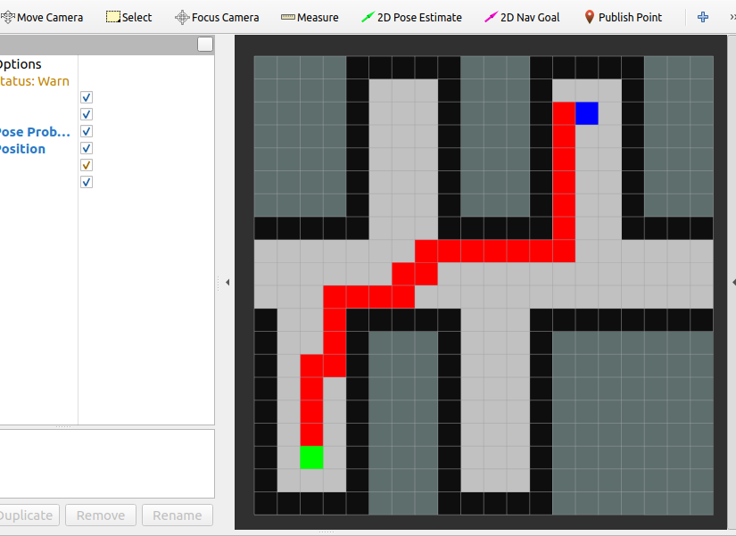

# Practical Course: Intelligent Mobile Robots with ROS (PCIMR)

## Tutorial 05: Omar Shalaby

To run the node run the simulator as usual by running:

```py
roslaunch pcimr_navigation navigation.launch
```

After that the astar solver node needs to be ram, this node takes the user input for 1 goal and solves the planning problem and outputs a path.
I didnt use Marker Line rather a collection of multiple markers because it looked much better at the end.

To run the node :


```py
rosrun pcimr_navigation astar_solver
```

Note, if another planning task is required please restart the node


Algorithm in action

 
